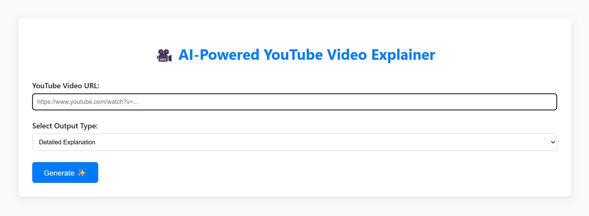
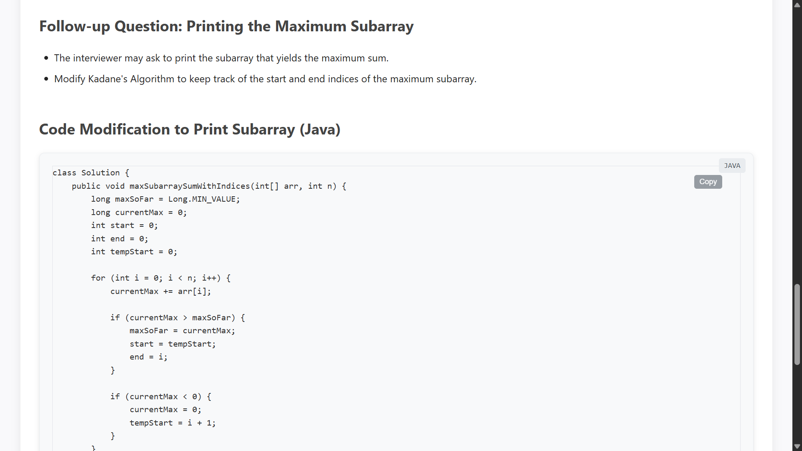

# 🎬 VidGist

**VidGist** is an AI-powered web application that transforms YouTube videos into detailed, human-style explanations — just like a person teaching you — along with concise summaries and revision-friendly notes.
, helping users save time while still understanding the full content. Whether it's an educational tutorial, a tech talk, or a long podcast – VidGist gives you the **gist** in seconds.


---

## 🚀 Features

- 🔗 Paste a YouTube link to extract content  
- 🧠 AI-generated summaries using Gemini  
- 📝 Structured speaker-style explanation  
- 📄 Markdown-friendly output with code formatting  
- 💾 Save and export summaries easily  

---

## 🛠️ Tech Stack

- **Frontend**: HTML, CSS, JavaScript  
- **Backend**: Python (Flask)  
- **AI Model**: Google Gemini (via API)  
- **Other**: YoutubeTrascriptApi, Markdown  

---

## 📦 Installation

1. **Clone the repo**

```bash
git clone https://github.com/pavan7479/vidgist.git
cd vidgist
```

2. **Create a virtual environment and activate it**

```bash
python -m venv venv
# On Windows
venv\Scripts\activate
# On macOS/Linux
source venv/bin/activate
```

3. **Install dependencies**

```bash
pip install -r requirements.txt
```

4. **Set up your API key**

```bash
# Create .env file
touch .env
# Add inside .env
GEMINI_API_KEY=your_google_generative_ai_key
```

5. **Run the app**

```bash
python app.py
```

Then visit `http://127.0.0.1:5000/` in your browser.

---

## 📁 Folder Structure

```
vidgist/
├── requirements.txt
├── templates/
│   └── index.html
├── assets/              # Logo and screenshots
│   ├── logo.png
│   ├── homepage.png
│   └── sample.png
├── app.py               # Flask backend
├── .env                 # API key (ignored in Git)
├── .gitignore
└── README.md
```

---

## 🔐 Security

Make sure your `.env` file is included in `.gitignore`:

```bash
.env
```

---

## 🌐 Deployment
try this link to view my website

[Coming soon... (or add the link here if deployed already, like👇)](https://vidgist-f1nh.onrender.com)

🔗 Live App

---

## 📸 Demo

### 🎥 Paste YouTube Link



---

### 🧠 AI-generated Summary



---

## ✨ Author

**Saipavan Biyyala**  
GitHub: [pavan7479](https://github.com/pavan7479)
